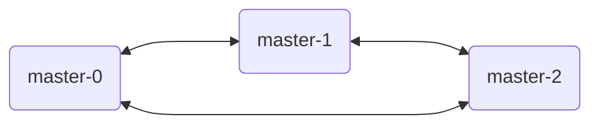
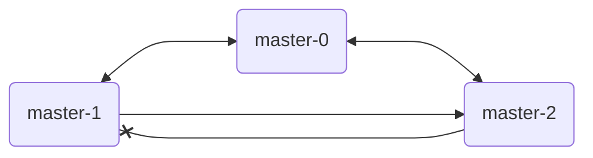
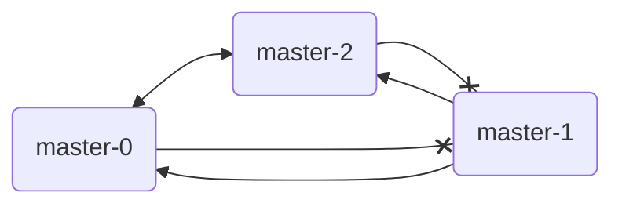

# es集群脑裂模拟[5.x]

参考文章

1. [[译]如何防止elasticsearch的脑裂问题](https://www.cnblogs.com/zhukunrong/p/5224558.html)

- ES版本: 5.5.0
- 集群规格: master * 3 + data * 3

`elasticsearch.yml`中存在如下配置

```yml
discovery.zen.minimum_master_nodes: 2
```

## 环境准备

```
[monitor@ly-xjf-r020807-gyt operator]$ kwd pod
NAME                    READY   STATUS    RESTARTS   AGE   IP               NODE                 NOMINATED NODE   READINESS GATES
es-0119-01-data-0       2/2     Running   0          16m   192.168.34.66    ly-xjf-r021704-gyt   <none>           <none>
es-0119-01-data-1       2/2     Running   0          16m   192.168.34.20    ly-xjf-r021702-gyt   <none>           <none>
es-0119-01-data-2       2/2     Running   0          16m   192.168.34.135   ly-xjf-r021703-gyt   <none>           <none>
es-0119-01-exporter-0   1/1     Running   0          16m   192.168.34.69    ly-xjf-r021704-gyt   <none>           <none>
es-0119-01-kibana-0     1/1     Running   0          16m   192.168.34.104   ly-xjf-r021704-gyt   <none>           <none>
es-0119-01-master-0     2/2     Running   0          16m   192.168.34.36    ly-xjf-r021704-gyt   <none>           <none>
es-0119-01-master-1     2/2     Running   0          16m   192.168.34.68    ly-xjf-r021702-gyt   <none>           <none>
es-0119-01-master-2     2/2     Running   0          16m   192.168.34.33    ly-xjf-r021703-gyt   <none>           <none>
```

请求任意节点的`/_cat/nodes`接口, 结果如下

```
192.168.34.33  5 13 8 0.79 2.05 2.57 mi - es-0119-01-master-2
192.168.34.68  4 59 5 2.61 1.37 1.21 mi * es-0119-01-master-1
192.168.34.66  4 50 4 0.60 1.23 1.74 di - es-0119-01-data-0
192.168.34.135 6 13 8 0.79 2.05 2.57 di - es-0119-01-data-2
192.168.34.20  4 59 5 2.61 1.37 1.21 di - es-0119-01-data-1
192.168.34.36  6 50 4 0.60 1.23 1.74 mi - es-0119-01-master-0
```

其中, es-0119-01-master-1为主Master节点.



## iptables模拟网络断开

由于当前容器网络为macvlan, 所以单纯在主机层面执行iptables命令是无法生效的, 因为容器间是通过网关"192.168.34.2"直接访问到对端的, 数据包在宿主机并不经过路由, 因此不会被iptables捕获到.

正确的做法是, 使用登陆到master-0所在主机, `nsenter`命令进入容器的命名空间, 再执行如下命令.

```
iptables -I OUTPUT -p tcp --dst 192.168.34.68 --dport 9211 -j DROP
iptables -I OUTPUT -p tcp --dst 192.168.34.68 --dport 9311 -j DROP
```

断开到 master-2 到 master-1 的单向连接, 但反过来 master-1 到 master-2 还是通的.



所以此时只有 master-2有异常日志输出.

```
[2022-01-19T22:19:05,497][INFO ][o.e.d.z.ZenDiscovery     ] [es-0119-01-master-2] master_left [{es-0119-01-master-1}{EErKdnU4R5eTM8kcdIe9zw}{qerKlzVQTvWLrhGc4egfOg}{192.168.34.68}{192.168.34.68:9311}{ml.enabled=true}], reason [failed to ping, tried [3] times, each with  maximum [30s] timeout]
[2022-01-19T22:19:05,499][WARN ][o.e.d.z.ZenDiscovery     ] [es-0119-01-master-2] master left (reason = failed to ping, tried [3] times, each with  maximum [30s] timeout), current nodes: nodes:
   {es-0119-01-data-0}{234hhLMzQFmBW5gkTcIfJA}{xAI6QhyWSzqKhnokSWAIEg}{192.168.34.66}{192.168.34.66:9311}{ml.enabled=true}
   {es-0119-01-data-2}{0JDHBbBPSNeQIhH1KlhXaQ}{sft0fCsMR9GuLyihz8lF8Q}{192.168.34.135}{192.168.34.135:9311}{ml.enabled=true}
   {es-0119-01-master-0}{sB5XM6iUSaeykwDlRPcTGg}{9r74LOrRSuqARjwF2blNUA}{192.168.34.36}{192.168.34.36:9311}{ml.enabled=true}
   {es-0119-01-master-2}{lz5bXkibSvCWvkIVVBL1EQ}{_8yszTagSrObjUfUUnbZQA}{192.168.34.33}{192.168.34.33:9311}{ml.enabled=true}, local
   {es-0119-01-data-1}{jOYjggouRYKS2iDIiMrmdQ}{4gdWvqFtQRSGh8AQexuCYw}{192.168.34.20}{192.168.34.20:9311}{ml.enabled=true}
   {es-0119-01-master-1}{EErKdnU4R5eTM8kcdIe9zw}{qerKlzVQTvWLrhGc4egfOg}{192.168.34.68}{192.168.34.68:9311}{ml.enabled=true}, master

[2022-01-19T22:19:09,257][WARN ][o.e.d.z.UnicastZenPing   ] [es-0119-01-master-2] failed to send ping to [{es-0119-01-master-1}{EErKdnU4R5eTM8kcdIe9zw}{qerKlzVQTvWLrhGc4egfOg}{192.168.34.68}{192.168.34.68:9311}{ml.enabled=true}]
org.elasticsearch.transport.ReceiveTimeoutTransportException: [es-0119-01-master-1][192.168.34.68:9311][internal:discovery/zen/unicast] request_id [4686] timed out after [3751ms]

## failed to send ping to [{es-0119-01-master-1} 重复3次

[2022-01-19T22:20:08,506][INFO ][o.e.d.z.ZenDiscovery     ] [es-0119-01-master-2] failed to send join request to master [{es-0119-01-master-1}{EErKdnU4R5eTM8kcdIe9zw}{qerKlzVQTvWLrhGc4egfOg}{192.168.34.68}{192.168.34.68:9311}{ml.enabled=true}], reason [ElasticsearchTimeoutException[java.util.concurrent.TimeoutException: Timeout waiting for task.]; nested: TimeoutException[Timeout waiting for task.]; ]
```

> 这里master-2检测到无法连接master-1, 耗时为90s("master_left"行的日志), 这一时间应该为"discovery.zen.fd.ping_timeout(默认为30s)"与"discovery.zen.fd.ping_retries(默认为3次)"的乘积.

最终显示为如下, 确认master-1已断连, 数据同步失败.

```
org.elasticsearch.xpack.monitoring.exporter.ExportException: failed to flush export bulk
```

然后, 用同样的方式让 master-0 也断开到 master-1 的连接.



90s后, master-0 也出现了`failed to send ping`.

但是ta没有继续狂刷报错, 而是过了十几秒左右, 出现了下面一条日志.

```
[2022-01-19T22:30:31,925][INFO ][o.e.c.s.ClusterService   ] [es-0119-01-master-0] removed {{es-0119-01-master-1}{EErKdnU4R5eTM8kcdIe9zw}{qerKlzVQTvWLrhGc4egfOg}{192.168.34.68}{192.168.34.68:9311}{ml.enabled=true},}, reason: zen-disco-receive(from master [master {es-0119-01-master-2}{lz5bXkibSvCWvkIVVBL1EQ}{_8yszTagSrObjUfUUnbZQA}{192.168.34.33}{192.168.34.33:9311}{ml.enabled=true} committed version [37]])
```

由于master-0与master-2无法连接到原来的主Master, 所以这两个合计着又组建了新的集群, 直接把master-1甩了, 认了master-2当新的主Master.

与此同时, master-2也一反常态, 不刷原来的报错了, 而是要把 master-1 降级的事告知给ta, 因为ta现在拥有2张选举票, 是合法的主Master了.(虽然与master-1的连接已断开, 但master-0/2本地仍存储着master-1的uuid, 知道master-1是曾经的主Master).

```
[2022-01-19T22:32:11,154][WARN ][o.e.d.z.ZenDiscovery     ] [es-0119-01-master-2] discovered [{es-0119-01-master-1}{EErKdnU4R5eTM8kcdIe9zw}{qerKlzVQTvWLrhGc4egfOg}{192.168.34.68}{192.168.34.68:9311}{ml.enabled=true}] which is also master but with an older cluster_state, telling [{es-0119-01-master-1}{EErKdnU4R5eTM8kcdIe9zw}{qerKlzVQTvWLrhGc4egfOg}{192.168.34.68}{192.168.34.68:9311}{ml.enabled=true}] to rejoin the cluster ([node fd ping])
```

此时, 脑裂形成, 分别请求 master-1, master-2 的`/_cat/nodes`接口, 会有不同的结果出现.

```
[monitor@ly-xjf-r020807-gyt operator]$ curl -u elastic:xxxxxx '192.168.34.68:9211/_cat/nodes'
192.168.34.135 4 13 7 0.27 1.16 2.18 di - es-0119-01-data-2
192.168.34.36  4 49 4 0.95 0.75 0.62 mi - es-0119-01-master-0
192.168.34.20  5 59 4 7.39 4.73 2.98 di - es-0119-01-data-1
192.168.34.66  6 49 4 0.95 0.75 0.62 di - es-0119-01-data-0
192.168.34.33  4 13 7 0.27 1.16 2.18 mi - es-0119-01-master-2
192.168.34.68  5 59 4 7.39 4.73 2.98 mi * es-0119-01-master-1
[monitor@ly-xjf-r020807-gyt operator]$ curl -u elastic:xxxxxx '192.168.34.36:9211/_cat/nodes'
192.168.34.33  4 13 8 0.25 1.14 2.17 mi * es-0119-01-master-2
192.168.34.66  4 49 4 0.95 0.75 0.62 di - es-0119-01-data-0
192.168.34.135 4 13 8 0.25 1.14 2.17 di - es-0119-01-data-2
192.168.34.20  6 59 4 7.36 4.77 3.00 di - es-0119-01-data-1
192.168.34.36  5 49 3 0.95 0.75 0.62 mi - es-0119-01-master-0
```

## 恢复通信

虽然上述操作已经重现了脑裂, 但是这是在网络仍然存在异常的情况下, 我们看下将网络恢复, 会发生什么.

分别进入 master-0, master-2 的网络空间, 执行如下命令解除ta们对 master-1 的单向屏蔽.

```
iptables -D OUTPUT -p tcp --dst 192.168.34.68 --dport 9211 -j DROP
iptables -D OUTPUT -p tcp --dst 192.168.34.68 --dport 9311 -j DROP
```

很快(这个时间应该和`discovery.zen.ping_timeout`配置有关, 默认为3s), master-1 就加入了由 master-0 和 master-2 集群.


master-2的日志

```
[2022-01-19T22:40:10,625][INFO ][o.e.c.s.ClusterService   ] [es-0119-01-master-0] added {{es-0119-01-master-1}{EErKdnU4R5eTM8kcdIe9zw}{qerKlzVQTvWLrhGc4egfOg}{192.168.34.68}{192.168.34.68:9311}{ml.enabled=true},}, reason: zen-disco-receive(from master [master {es-0119-01-master-2}{lz5bXkibSvCWvkIVVBL1EQ}{_8yszTagSrObjUfUUnbZQA}{192.168.34.33}{192.168.34.33:9311}{ml.enabled=true} committed version [38]])
```

master-2的日志

```
[2022-01-19T22:41:17,274][INFO ][o.e.c.s.ClusterService   ] [es-0119-01-master-2] added {{es-0119-01-master-1}{EErKdnU4R5eTM8kcdIe9zw}{qerKlzVQTvWLrhGc4egfOg}{192.168.34.68}{192.168.34.68:9311}{ml.enabled=true},}, reason: zen-disco-node-join[{es-0119-01-master-1}{EErKdnU4R5eTM8kcdIe9zw}{qerKlzVQTvWLrhGc4egfOg}{192.168.34.68}{192.168.34.68:9311}{ml.enabled=true}]
```

master-1也低下了高傲的头, 认输了, 加入了新集群.

```
[2022-01-19T22:41:42,348][INFO ][o.e.c.s.ClusterService   ] [es-0119-01-master-1] detected_master {es-0119-01-master-2}{lz5bXkibSvCWvkIVVBL1EQ}{_8yszTagSrObjUfUUnbZQA}{192.168.34.33}{192.168.34.33:9311}{ml.enabled=true}, reason: zen-disco-receive(from master [master {es-0119-01-master-2}{lz5bXkibSvCWvkIVVBL1EQ}{_8yszTagSrObjUfUUnbZQA}{192.168.34.33}{192.168.34.33:9311}{ml.enabled=true} committed version [38]])
```

此时再查看各节点的`/_cat/nodes`接口, 数据已经统一了.

> 目前还不清楚是否会存在因为某些极端问题, 导致最终即使网络全部恢复, 仍然会出现脑裂并持续的情况.
