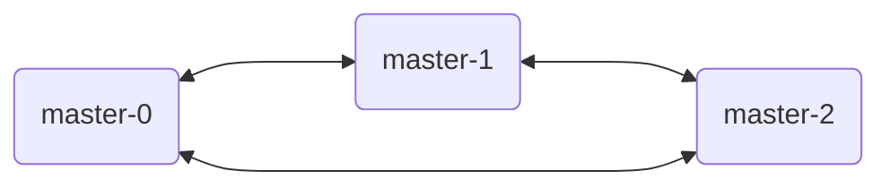
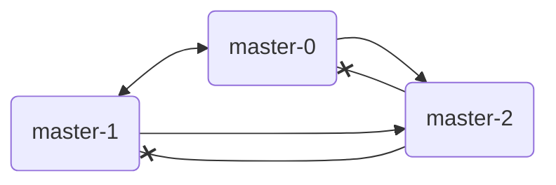

# es集群脑裂模拟[5.x]

参考文章

1. [[译]如何防止elasticsearch的脑裂问题](https://www.cnblogs.com/zhukunrong/p/5224558.html)

- ES版本: 5.5.0
- 集群规格: master * 3 + data * 3

前一篇文章中, 我们通过在从Master上单向断开到主Master的连接, 重现了脑裂的场景.

在本篇文章中, 我们将尝试在主Master节点处, 断开与两个从Master节点的单向连接, 即, 两个从Master仍然可以连接到主Master.

当前集群状态如下

```
192.168.34.66  7 50 4 1.39 0.91 0.84 di - hjl-es-0119-01-data-0
192.168.34.135 5 13 7 1.16 1.49 1.68 di - hjl-es-0119-01-data-2
192.168.34.36  4 50 4 1.39 0.91 0.84 mi - hjl-es-0119-01-master-0
192.168.34.33  5 13 7 1.16 1.49 1.68 mi * hjl-es-0119-01-master-2
192.168.34.20  5 59 5 1.01 2.17 2.67 di - hjl-es-0119-01-data-1
192.168.34.68  5 59 5 1.01 2.17 2.67 mi - hjl-es-0119-01-master-1
```



使用`nsenter`工具进入主Master节点master-2的网络空间, 执行如下命令.

```
iptables -I OUTPUT -p tcp --dst 192.168.34.36 --dport 9211 -j DROP
iptables -I OUTPUT -p tcp --dst 192.168.34.36 --dport 9311 -j DROP
iptables -I OUTPUT -p tcp --dst 192.168.34.68 --dport 9211 -j DROP
iptables -I OUTPUT -p tcp --dst 192.168.34.68 --dport 9311 -j DROP
```

master-2的日志如下, ta将master-0和master-1先后从集群中删除. 此时原本集群中, 只剩下master-2一个master节点了. 



> 与上篇文章不同的是, 此时master-2的`/_cat/health`接口已经无法响应了, 因为单个master无法统计集群状态.

```
[2022-01-20T00:00:51,620][INFO ][o.e.c.s.ClusterService   ] [hjl-es-0119-01-master-2] removed {{hjl-es-0119-01-master-0}{sB5XM6iUSaeykwDlRPcTGg}{9r74LOrRSuqARjwF2blNUA}{192.168.34.36}{192.168.34.36:9311}{ml.enabled=true},}, reason: zen-disco-node-failed({hjl-es-0119-01-master-0}{sB5XM6iUSaeykwDlRPcTGg}{9r74LOrRSuqARjwF2blNUA}{192.168.34.36}{192.168.34.36:9311}{ml.enabled=true}), reason(failed to ping, tried [3] times, each with maximum [30s] timeout)[{hjl-es-0119-01-master-0}{sB5XM6iUSaeykwDlRPcTGg}{9r74LOrRSuqARjwF2blNUA}{192.168.34.36}{192.168.34.36:9311}{ml.enabled=true} failed to ping, tried [3] times, each with maximum [30s] timeout]
[2022-01-20T00:01:21,624][WARN ][o.e.c.s.ClusterService   ] [hjl-es-0119-01-master-2] failing [zen-disco-node-failed({hjl-es-0119-01-master-0}{sB5XM6iUSaeykwDlRPcTGg}{9r74LOrRSuqARjwF2blNUA}{192.168.34.36}{192.168.34.36:9311}{ml.enabled=true}), reason(failed to ping, tried [3] times, each with maximum [30s] timeout)[{hjl-es-0119-01-master-0}{sB5XM6iUSaeykwDlRPcTGg}{9r74LOrRSuqARjwF2blNUA}{192.168.34.36}{192.168.34.36:9311}{ml.enabled=true} failed to ping, tried [3] times, each with maximum [30s] timeout]]: failed to commit cluster state version [40]
org.elasticsearch.discovery.Discovery$FailedToCommitClusterStateException: timed out while waiting for enough masters to ack sent cluster state. [1] left
[2022-01-20T00:01:21,628][INFO ][o.e.c.s.ClusterService   ] [hjl-es-0119-01-master-2] removed {{hjl-es-0119-01-master-1}{EErKdnU4R5eTM8kcdIe9zw}{qerKlzVQTvWLrhGc4egfOg}{192.168.34.68}{192.168.34.68:9311}{ml.enabled=true},}, reason: zen-disco-node-failed({hjl-es-0119-01-master-1}{EErKdnU4R5eTM8kcdIe9zw}{qerKlzVQTvWLrhGc4egfOg}{192.168.34.68}{192.168.34.68:9311}{ml.enabled=true}), reason(failed to ping, tried [3] times, each with maximum [30s] timeout)[{hjl-es-0119-01-master-1}{EErKdnU4R5eTM8kcdIe9zw}{qerKlzVQTvWLrhGc4egfOg}{192.168.34.68}{192.168.34.68:9311}{ml.enabled=true} failed to ping, tried [3] times, each with maximum [30s] timeout]
```

master-0与master-1还不明白发生了什么, 就被主MasterT出集群了, 然后被T出这两个master节点又额外组建了新集群. 

master-1的日志如下

```
[2022-01-20T00:02:17,540][INFO ][o.e.d.z.ZenDiscovery     ] [hjl-es-0119-01-master-1] master_left [{hjl-es-0119-01-master-2}{lz5bXkibSvCWvkIVVBL1EQ}{_8yszTagSrObjUfUUnbZQA}{192.168.34.33}{192.168.34.33:9311}{ml.enabled=true}], reason [no longer master]
org.elasticsearch.transport.RemoteTransportException: [hjl-es-0119-01-master-2][192.168.34.33:9311][internal:discovery/zen/fd/master_ping]
Caused by: org.elasticsearch.cluster.NotMasterException: local node is not master
[2022-01-20T00:02:17,547][WARN ][o.e.d.z.ZenDiscovery     ] [hjl-es-0119-01-master-1] master left (reason = no longer master), current nodes: nodes:
   {hjl-es-0119-01-master-1}{EErKdnU4R5eTM8kcdIe9zw}{qerKlzVQTvWLrhGc4egfOg}{192.168.34.68}{192.168.34.68:9311}{ml.enabled=true}, local
   {hjl-es-0119-01-data-0}{234hhLMzQFmBW5gkTcIfJA}{xAI6QhyWSzqKhnokSWAIEg}{192.168.34.66}{192.168.34.66:9311}{ml.enabled=true}
   {hjl-es-0119-01-master-0}{sB5XM6iUSaeykwDlRPcTGg}{9r74LOrRSuqARjwF2blNUA}{192.168.34.36}{192.168.34.36:9311}{ml.enabled=true}
   {hjl-es-0119-01-data-2}{0JDHBbBPSNeQIhH1KlhXaQ}{sft0fCsMR9GuLyihz8lF8Q}{192.168.34.135}{192.168.34.135:9311}{ml.enabled=true}
   {hjl-es-0119-01-master-2}{lz5bXkibSvCWvkIVVBL1EQ}{_8yszTagSrObjUfUUnbZQA}{192.168.34.33}{192.168.34.33:9311}{ml.enabled=true}, master
   {hjl-es-0119-01-data-1}{jOYjggouRYKS2iDIiMrmdQ}{4gdWvqFtQRSGh8AQexuCYw}{192.168.34.20}{192.168.34.20:9311}{ml.enabled=true}

[2022-01-20T00:02:20,553][INFO ][o.e.c.s.ClusterService   ] [hjl-es-0119-01-master-1] new_master {hjl-es-0119-01-master-1}{EErKdnU4R5eTM8kcdIe9zw}{qerKlzVQTvWLrhGc4egfOg}{192.168.34.68}{192.168.34.68:9311}{ml.enabled=true}, reason: zen-disco-elected-as-master ([1] nodes joined)[{hjl-es-0119-01-master-0}{sB5XM6iUSaeykwDlRPcTGg}{9r74LOrRSuqARjwF2blNUA}{192.168.34.36}{192.168.34.36:9311}{ml.enabled=true}]
```

> "new_master"所在行表示, master-1被选举为新的主Master了.

master-0的日志如下

```
[2022-01-20T00:00:45,186][INFO ][o.e.d.z.ZenDiscovery     ] [hjl-es-0119-01-master-0] master_left [{hjl-es-0119-01-master-2}{lz5bXkibSvCWvkIVVBL1EQ}{_8yszTagSrObjUfUUnbZQA}{192.168.34.33}{192.168.34.33:9311}{ml.enabled=true}], reason [no longer master]
org.elasticsearch.transport.RemoteTransportException: [hjl-es-0119-01-master-2][192.168.34.33:9311][internal:discovery/zen/fd/master_ping]
Caused by: org.elasticsearch.cluster.NotMasterException: local node is not master
[2022-01-20T00:00:45,198][WARN ][o.e.d.z.ZenDiscovery     ] [hjl-es-0119-01-master-0] master left (reason = no longer master), current nodes: nodes:
   {hjl-es-0119-01-master-2}{lz5bXkibSvCWvkIVVBL1EQ}{_8yszTagSrObjUfUUnbZQA}{192.168.34.33}{192.168.34.33:9311}{ml.enabled=true}, master
   {hjl-es-0119-01-master-1}{EErKdnU4R5eTM8kcdIe9zw}{qerKlzVQTvWLrhGc4egfOg}{192.168.34.68}{192.168.34.68:9311}{ml.enabled=true}
   {hjl-es-0119-01-data-0}{234hhLMzQFmBW5gkTcIfJA}{xAI6QhyWSzqKhnokSWAIEg}{192.168.34.66}{192.168.34.66:9311}{ml.enabled=true}
   {hjl-es-0119-01-data-2}{0JDHBbBPSNeQIhH1KlhXaQ}{sft0fCsMR9GuLyihz8lF8Q}{192.168.34.135}{192.168.34.135:9311}{ml.enabled=true}
   {hjl-es-0119-01-data-1}{jOYjggouRYKS2iDIiMrmdQ}{4gdWvqFtQRSGh8AQexuCYw}{192.168.34.20}{192.168.34.20:9311}{ml.enabled=true}
   {hjl-es-0119-01-master-0}{sB5XM6iUSaeykwDlRPcTGg}{9r74LOrRSuqARjwF2blNUA}{192.168.34.36}{192.168.34.36:9311}{ml.enabled=true}, local

[2022-01-20T00:00:48,759][INFO ][o.e.c.s.ClusterService   ] [hjl-es-0119-01-master-0] detected_master {hjl-es-0119-01-master-1}{EErKdnU4R5eTM8kcdIe9zw}{qerKlzVQTvWLrhGc4egfOg}{192.168.34.68}{192.168.34.68:9311}{ml.enabled=true}, reason: zen-disco-receive(from master [master {hjl-es-0119-01-master-1}{EErKdnU4R5eTM8kcdIe9zw}{qerKlzVQTvWLrhGc4egfOg}{192.168.34.68}{192.168.34.68:9311}{ml.enabled=true} committed version [40]])
```

> "detected_master"表示, master-0接受了新的主Master(即master-1节点).

由于之前的操作是单向屏蔽 master-2 无法感知到 master-0 与 master-1, 但反过来, master-0与master-1新组建集群后, 又立刻发现了 master-2, 并将其重新纳入集群, 且剥夺了其原本的主Master地位, 成为了一个从Master.

------

恢复网络的命令如下.

```
iptables -D OUTPUT -p tcp --dst 192.168.34.36 --dport 9211 -j DROP
iptables -D OUTPUT -p tcp --dst 192.168.34.36 --dport 9311 -j DROP
iptables -D OUTPUT -p tcp --dst 192.168.34.68 --dport 9211 -j DROP
iptables -D OUTPUT -p tcp --dst 192.168.34.68 --dport 9311 -j DROP
```
